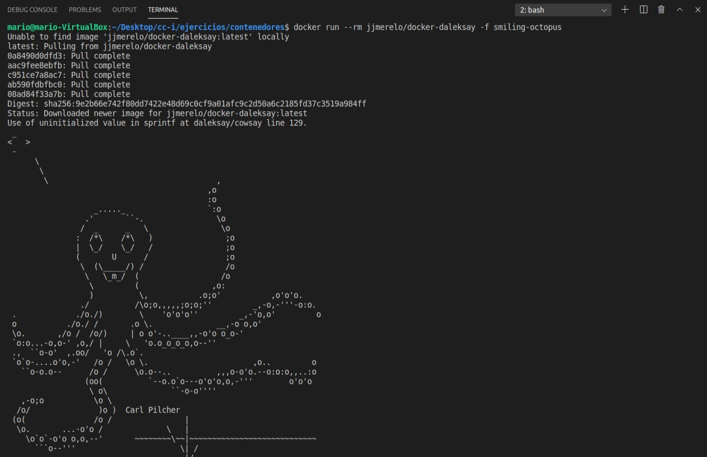
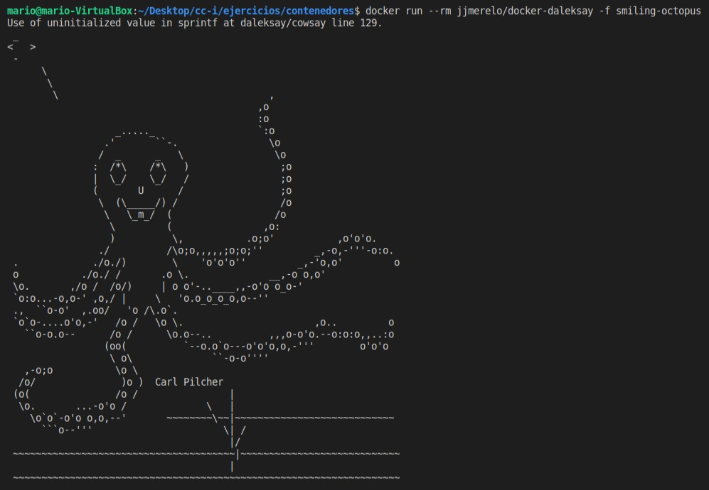
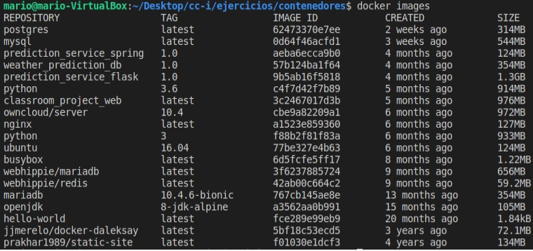

# Ejercicios Microservicios.
### Ejercicio 1: 

__Buscar alguna demo interesante de Docker y ejecutarla localmente, o en su defecto, ejecutar la imagen anterior y ver cómo funciona y los procesos que se llevan a cabo la primera vez que se ejecuta y las siguientes ocasiones.__

### Ejercicio 2: 

__Tomar algún programa simple, “Hola mundo” impreso desde el intérprete de línea de órdenes, y comparar el tamaño de las imágenes de diferentes sistemas operativos base, Fedora, CentOS y Alpine, por ejemplo__

En la siguiente ilustración se muestran las imágenes de Docker disponibles en el sistema local. Por ejemplo, las imágenes de postgres, mariadb y mysql, con objetivos similares varían en más
de 100 Mb de tamaño entre ellas.

