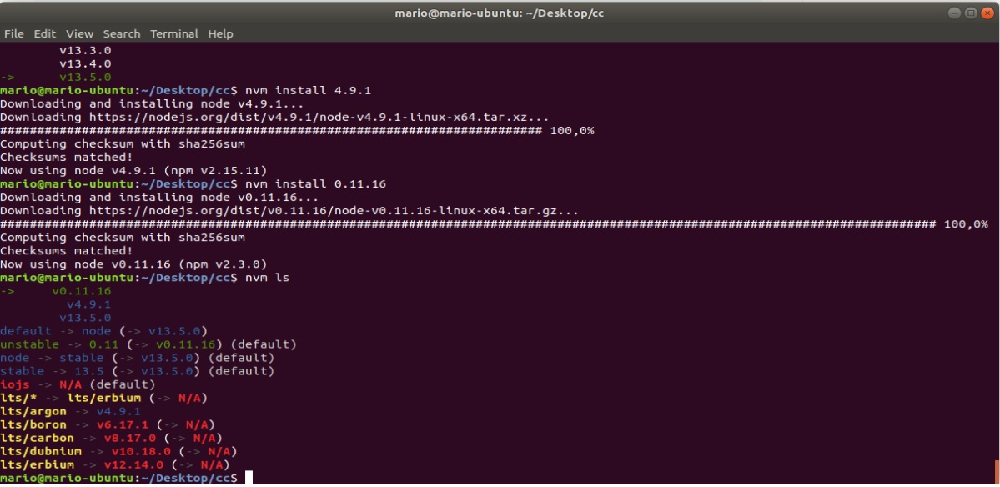
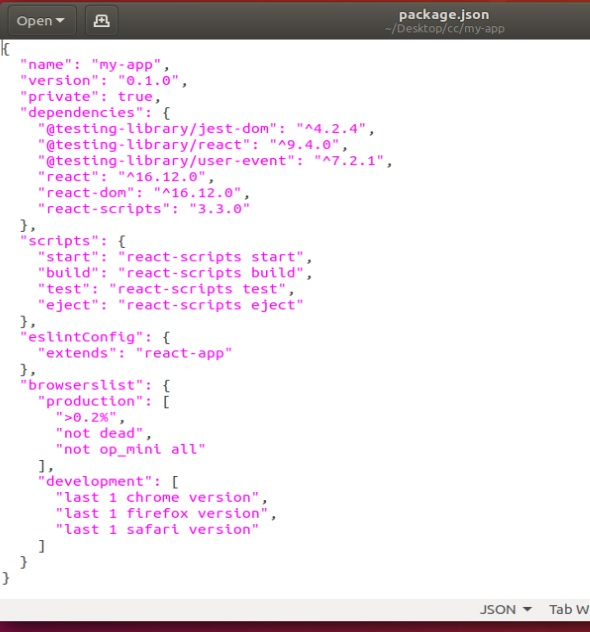
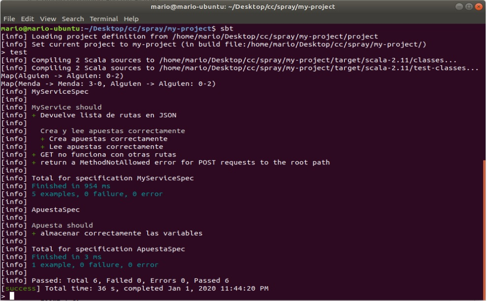

# Ejercicios Desarrollo basado en pruebas.
### Ejercicio 1: 

__Instalar alguno de los entornos virtuales de node.js (o de cualquier otro lenguaje con el que se esté familiarizado) y, con ellos, instalar la última versión existente, la versión minor más actual de la 4.x y lo mismo para la 0.11 o alguna impar (de desarrollo)__

### Ejercicio 2: 

__Crear una descripción del módulo usando package.json. En caso de que se trate de otro lenguaje, usar el método correspondiente__

En el siguiente ejemplo se muestra como queda el archivo package.json luego de crear una aplicación react utilizando [create-react-app](https://github.com/facebook/create-react-app)

### Ejercicio 3: 

__Descargar el repositorio de ejemplo anterior, instalar las herramientas necesarias (principalmente Scala y sbt) y ejecutar el ejemplo desde sbt__

