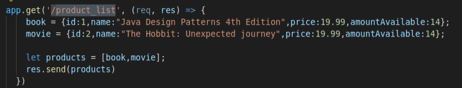
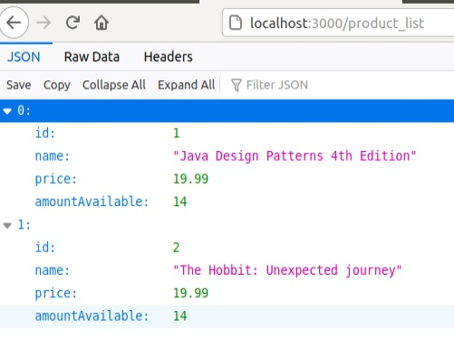

# Ejercicios Microservicios.
### Ejercicio 1: 

__Realizar una aplicación básica que use express para devolver alguna estructura de datos del modelo que se viene usando en el curso__

En las siguientes imágenes se muestra la implementación del servicio /product_list en Express, y la respuesta de dicho servicio compuesta por una lista de 2 productos.

### Ejercicio 2: 

__Programar un microservicio en express (o el lenguaje y marco elegido) que incluya variables como en el caso anterior.__

En SpringBoot, la definición de variables para los servicios se implementa a través de la anotación @PathVariable. En el extracto de código siguiente, se implementa el servicio
de eliminar productos. Se utiliza la variable id para localizar y eliminar el prodcuto en el almacén de datos elegido.

    /**
     * DELETE  /delete -> Deletes a product.
     */
    @RequestMapping(value = "/delete/{id}",
            method = RequestMethod.POST,
            produces = MediaType.APPLICATION_JSON_VALUE)
    public ResponseEntity<?> delete( @PathVariable int id) {
        HttpHeaders responseHeaders = new HttpHeaders();
        responseHeaders.set("status", "OK");
        boolean deleted = productService.deleteProduct(id);
        if (deleted) {
            return ResponseEntity.ok().headers(responseHeaders).body(null);
        } else {
            //Bad request response due to non existent product identifier
            return ResponseEntity.badRequest().headers(responseHeaders).body(null);
        }
    }